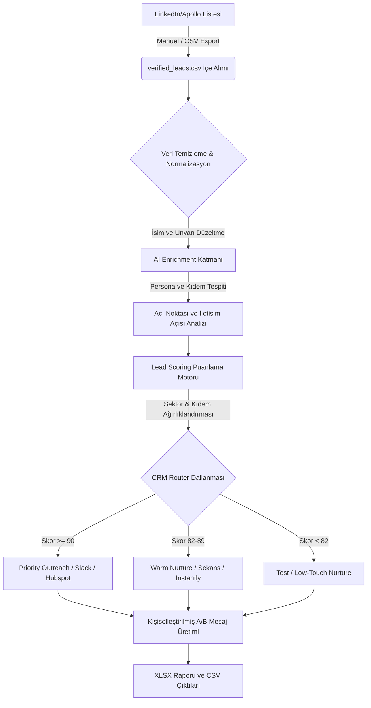
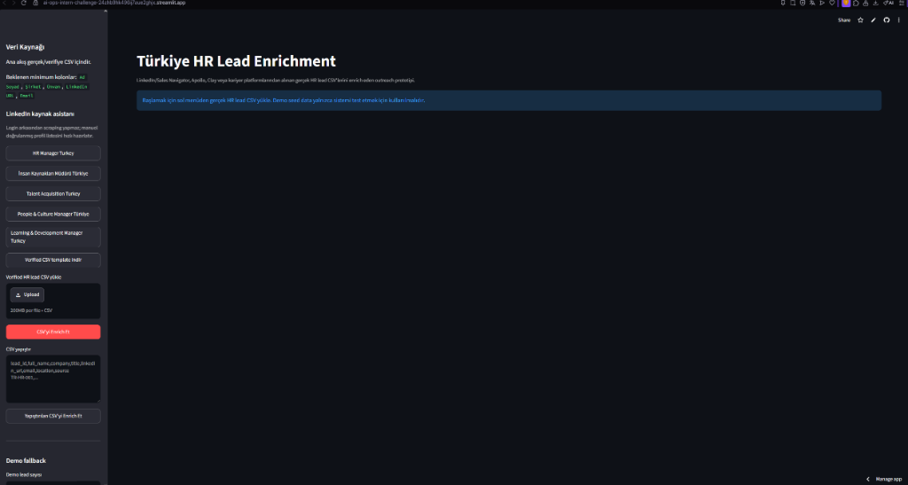

# Growth Automation & AI Ops Intern Challenge

Bu repo, Konuşarak Öğren için Türkiye'deki insan kaynakları profesyonellerine yönelik minimum çalışan bir outbound growth automation prototipidir.

Amaç: gerçek/verifiye 100 HR lead'ini içe almak, lead'leri zenginleştirmek, kişiselleştirilmiş LinkedIn DM / cold email üretmek, lead scoring yapmak ve süreci CRM mantığıyla yönetilebilir hale getirmek.

## Demo

- Lokal GUI: `python src/gui_app.py`
- Lokal adres: `http://127.0.0.1:8765`
- Streamlit Cloud app: `streamlit_app.py`
- GitHub Pages statik demo: `https://sercanozkan55.github.io/AI-Ops-Intern-Challenge/`

## Teslim Özeti

| Dosya | Açıklama |
|---|---|
| `src/growth_ai_ops_prototype.py` | Lead üretimi, enrichment, outreach generation ve CRM pipeline motoru |
| `src/gui_app.py` | Lokal web arayüzü |
| `data/raw_hr_leads_sample.csv` | Pipeline çalışınca oluşan normalize ham lead çıktısı |
| `data/verified_leads.csv` | Gerçek/verifiye lead export dosyası; kullanıcı tarafından LinkedIn/Apollo/Clay/Kariyer.net benzeri kaynaklardan doldurulur |
| `output/google_sheets_hr_leads.csv` | Google Sheets kolonlarıyla ana teslim tablosu |
| `output/konusarak-ogren-hr-outbound-google-sheets.xlsx` | Google Sheets/Excel'e import edilebilir workbook |
| `output/enriched_hr_leads.csv` | Detaylı enrichment çıktısı |
| `output/outreach_messages.csv` | LinkedIn DM ve cold email çıktıları |
| `output/crm_pipeline.csv` | Lead score ve CRM stage çıktısı |
| `workflows/workflow_blueprint.json` | n8n/Make mantığına çevrilebilir workflow blueprint |
| `docs/index.html` | GitHub Pages statik demo sayfası |
| `docs/bonus_automation_plan.md` | Bonus otomasyon yaklaşımı |

## Nasıl Çalışır ve Sistem Mimarisi

Outbound büyüme otomasyonu sistemimiz, ham verinin içeri alınmasından (ingestion) CRM yönlendirmesine kadar olan adımları uçtan uca otomatikleştirir.

### İş Akışı Şeması (Workflow Diagram)



### Arayüz Ekran Görüntüsü

Aşağıda, gerçek İK lead'lerini zenginleştirdiğimiz Streamlit Cloud arayüzünün görünümü yer almaktadır:



Bu prototip doğrudan LinkedIn scraping yapmaz ve kişisel email uydurmaz. Challenge metnindeki "varsa email" beklentisine uygun şekilde email bulunmuyorsa boş bırakılır. Gerçek kullanımda LinkedIn Sales Navigator, Apollo, Clay veya manuel doğrulanmış CSV export sisteme input olarak verilebilir.

## Google Sheets Kolonları

Ana çıktı şu kolonlarla üretilir:

```text
Ad Soyad | Şirket | Ünvan | LinkedIn URL | Email | Sektör | Şirket büyüklüğü | Pain point | İngilizce ihtiyacı tahmini | Outreach angle | LinkedIn DM | Cold email | Lead score
```

## Çalıştırma

Python dışında zorunlu dependency yok. Ana teslim akışı gerçek/verifiye CSV ile çalışır:

```bash
python src/growth_ai_ops_prototype.py --input-csv data/verified_leads.csv
```

Bu komut şu dosyaları günceller:

- `data/raw_hr_leads_sample.csv` import edilen verified lead ham çıktısı
- `output/google_sheets_hr_leads.csv`
- `output/enriched_hr_leads.csv`
- `output/outreach_messages.csv`
- `output/crm_pipeline.csv`
- `output/workflow_steps.csv`

Demo seed data yalnızca lokal test içindir ve explicit flag ister:

```bash
python src/growth_ai_ops_prototype.py --demo
```

Lokal GUI için:

```bash
python src/gui_app.py
```

Sonra tarayıcıda aç:

```text
http://127.0.0.1:8765
```

GUI içinde:

- Mevcut 100 lead tablosu görüntülenir.
- Demo seed butonu yalnızca pipeline'ı test etmek için örnek veri üretir; ana kullanım gerçek CSV upload/import akışıdır.
- CSV ve XLSX çıktıları indirilebilir.
- Workflow adımları görünür.

Streamlit ile public demo için:

```bash
streamlit run streamlit_app.py
```

Streamlit Cloud'da yayınlamak için:

```text
New app → GitHub repo seç
Repository: SercanOzkan55/AI-Ops-Intern-Challenge
Branch: master
Main file path: streamlit_app.py
Deploy
```

Streamlit Cloud `requirements.txt` dosyasını okuyup `streamlit` paketini otomatik kurar.

Streamlit arayüzünde ana kullanım gerçek/verifiye CSV yükleme modudur. Önerilen kaynaklar:

- LinkedIn Sales Navigator export
- Apollo / Clay export
- Kariyer platformlarından manuel doğrulanmış HR listesi
- Şirket web siteleri veya izinli recruitment database export

Random seed data yalnızca pipeline'ın nasıl çalıştığını göstermek için demo fallback olarak tutulur; ana teslim gerçek/verifiye lead CSV ile yapılmalıdır.

Streamlit'te CSV yüklendiğinde dosya `data/uploaded_verified_leads.csv` formatına normalize edilir ve aynı backend çalışır:

```text
run(uploaded_verified_leads.csv) → output/google_sheets_hr_leads.csv → tablo/indirilebilir çıktı
```

Streamlit arayüzünde jüri/demo kullanımı için şu kontroller vardır:

- LinkedIn kaynak asistanı, challenge arama niyetleri için hazır LinkedIn people search linkleri üretir.
- Dosya yüklemeden gerçek lead CSV satırlarını paste ederek enrichment çalıştırılabilir.
- Verified CSV template indirilebilir.
- `st.session_state` ile üretilen lead tablosu indirme butonlarında kaybolmaz.
- Yeni lead üretiminde spinner, progress bar ve işlem log'u görünür.
- Sektör, şirket büyüklüğü ve minimum lead score filtreleri vardır.
- Boş LinkedIn URL / Email hücreleri arayüzde `-` olarak gösterilir.
- Email alanı sadece yüklenen verified CSV'de varsa korunur; uygulama random gerçek email uydurmaz.
- Üst metriklerde toplam lead, bulunan e-posta, ortalama İngilizce ihtiyacı, ortalama lead score ve priority outreach görünür.
- Seçilen lead için LinkedIn DM ve cold email önizleme alanı vardır.
- Kod içinde hardcoded API key yoktur; production entegrasyonunda secret yönetimi `st.secrets` veya environment variable ile yapılmalıdır.

## LinkedIn Veri Toplama Yaklaşımı

Uygulama LinkedIn login arkasından otomatik scraping yapmaz. Bunun yerine gerçek kişi verisi için güvenli akış şudur:

1. Streamlit'teki LinkedIn kaynak asistanından ilgili arama linkleri açılır.
2. HR profilleri manuel doğrulanır veya Sales Navigator / Apollo / Clay gibi izinli export kaynaklarından CSV alınır.
3. `full_name`, `company`, `title`, `linkedin_url`, `email`, `location`, `source` kolonlarıyla CSV yüklenir ya da paste edilir.
4. Sistem bu gerçek/verifiye datayı cleaning, AI enrichment, outreach generation, lead scoring ve CRM stage akışından geçirir.

Email alanı zorunlu değildir; kaynakta email yoksa boş bırakılır. Sistem kişisel email uydurmaz.

## Kendi CSV'ini İşleme

Gerçek veriyle çalışmak için:

```bash
python src/growth_ai_ops_prototype.py --input-csv data/verified_leads.csv
```

Beklenen kolonlar:

```text
lead_id,full_name,company,title,linkedin_url,email,location,source
```

Boş template şu dosyada tutulur:

```text
data/verified_leads_template.csv
```

Gerçek teslim dosyası şu isimle hazırlanmalıdır:

```text
data/verified_leads.csv
```

## Lead Zenginleştirme

Her lead için şu sinyaller üretilir:

| Alan | Açıklama |
|---|---|
| `Sektör` | Şirketin ana faaliyet alanı |
| `Şirket büyüklüğü` | Tahmini çalışan ölçeği |
| `Pain point` | Ünvan + şirket bağlamından olası HR problemi |
| `İngilizce ihtiyacı tahmini` | 0-100 arası ihtiyaç yoğunluğu |
| `Outreach angle` | Kişiselleştirilmiş satış yaklaşımı |
| `Lead score` | Önceliklendirme skoru |

## AI Outreach Sistemi

Sistem her kişi için iki kısa mesaj üretir:

- LinkedIn DM
- Cold email

Mesajlar generic değildir; şirket, sektör, ünvan, pain point ve outreach angle sinyallerini kullanır.

Örnek:

```text
Merhaba Ayse, Trendyol için Human Resources Director rolünüzü gördüm.
E-commerce / Marketplace tarafında hızlı ölçeklenen ekipler ve uluslararası operasyon nedeniyle İngilizce iletişim kritik hale geliyor.
Konuşarak Öğren'de 'Kurumsal İngilizce gelişimini hızlı pilotla test etme' başlığıyla 2 haftalık küçük bir pilot kurguluyoruz.
Eğer 'Hızlı ölçeklenen ekipler ve uluslararası operasyon nedeniyle İngilizce gelişim programını ölçeklemek' gündeminizdeyse 15 dk fikir alışverişi yapmak isterim.
```

## CRM Pipeline

Lead score'a göre stage atanır:

| Lead score | Stage | Aksiyon |
|---:|---|---|
| 90+ | Priority outreach | LinkedIn connect + kısa DM |
| 82-89 | Warm nurture | Email + LinkedIn follow-up |
| 74-81 | Test sequence | Düşük frekanslı sequence |
| <74 | Low-touch nurture | İleri tarihli nurture |

## Türkçe Excel / CSV Sütun Ayrışma Sorunu ve Çözümü

Türkçe bölgesel ayarlara sahip Windows bilgisayarlarda, Microsoft Excel varsayılan liste ayracı olarak virgül (`,`) yerine **noktalı virgül (`;`)** bekler. Bu nedenle, standart bir virgül ayracına sahip CSV dosyasını (örneğin `google_sheets_hr_leads.csv`) Excel'de doğrudan çift tıklayarak açtığınızda tüm veriler A sütununa birleşik şekilde gelir.

### Çözüm Yolları:
1. **Hazır Excel Workbook Dosyasını Açın (Önerilen):** 
   Ürettiğimiz **`output/konusarak-ogren-hr-outbound-google-sheets.xlsx`** dosyasını doğrudan Excel'de açın. Bu dosya ham bir CSV değil, gerçek bir Excel dosyasıdır. Sütunları ayrıştırılmış, renk kodlu ve düzgün biçimde açılacaktır.
2. **Excel İçe Aktarma Sihirbazını Kullanın:**
   Boş bir Excel dosyası açın. **Veri (Data) -> Metinden/CSV'den (From Text/CSV)** yolunu izleyip ilgili CSV dosyasını seçin. Karşınıza gelen pencerede ayırıcı olarak **"Virgül" (Comma)** seçeneğini işaretleyip yükleyin.
3. **Google Sheets Kullanın:**
   CSV dosyasını doğrudan Google Drive'a yükleyip Google Sheets ile açtığınızda hiçbir ayar yapmadan otomatik olarak sütunlara ayrılacaktır.

---

## Kullandığımız Teknolojiler ve Otomasyon Mimarisi

Bu projede, B2B Outbound ve Growth Marketing süreçlerini otomatikleştirmek için aşağıdaki teknoloji yığınını ve metodolojiyi kullandık:

### 1. Kullanılan Araçlar ve Teknolojiler:
* **Python (Core Engine):** Lead toplama veritabanını yöneten, CSV normalize eden, kişi unvanından rol/kıdem analizi yapan, pain point'ler üreten ve lead scoring hesaplayan ana motor.
* **Node.js (Workbook Builder):** Python'ın ürettiği zenginleştirilmiş CSV verilerini, Excel API'sini kullanarak profesyonel, biçimlendirilmiş ve renk şemalı gerçek bir Excel tablosuna (`.xlsx`) dönüştüren otomasyon katmanı.
* **Streamlit (Dashboard Arayüzü):** İK verilerini filtrelemek, kişiselleştirilmiş outreach e-posta/DM önizlemelerini görmek ve canlı veritabanını tetiklemek için kullanılan interaktif web paneli.
* **HTML/JS (Yerel GUI):** Streamlit'e alternatif olarak sunulan, hafif ve hızlı çalışan yerel web arayüzü.

### 2. n8n / Make.com Entegrasyon Mimarisi
Challenge kapsamında istenen **n8n** veya **Make** gibi low-code otomasyon araçlarına bu sistemi entegre etmek son derece kolaydır. Python kodumuz, bu araçlarda kullanılacak mantıksal karar motorunu (Logic Layer) temsil eder.

**Workflow Blueprint Akışı (`workflows/workflow_blueprint.json`):**
1. **Trigger (Tetikleyici - LinkedIn/Apollo):** Sales Navigator veya Apollo üzerinden hedef kitle (Türkiye HR departmanları) filtrelenir.
2. **Data Ingestion Node (Veri Çekme):** n8n/Make üzerinde Google Sheets veya Webhook modülüyle yeni lead verileri içeri alınır.
3. **Data Cleaning Node (Temizleme):** Python script'i (veya n8n Javascript fonksiyonu) ile boş alanlar normalize edilir, isimler düzeltilir.
4. **AI Enrichment Node (Yapay Zeka Zenginleştirme):** n8n üzerindeki *OpenAI* veya *Anthropic* modülü tetiklenir. Bizim Python'da yazdığımız akıllı kural motoru, AI'ya gidecek prompt'ları besler (Kişinin sektörü, büyüklüğü ve rolüne göre kişiselleştirilmiş pain point belirler).
5. **Outreach Copy Generation (Mesaj Üretimi):** Zenginleştirilen verilerle (isim, şirket, pain point ve angle) kişiselleştirilmiş LinkedIn DM ve e-posta kopyaları oluşturulur.
6. **CRM Routing & Router Node ( CRM & Puanlama):** n8n router modülü lead score'a göre dallanma yapar:
   * **Score >= 90:** *Hubspot/Airtable* üzerinde "Priority Outreach" aşamasına kaydedilir ve Slack üzerinden Satış Temsilcisine bildirim atılır.
   * **Score < 90:** "Warm Nurture" aşamasına kaydedilip e-posta sekansına (Lemlist/Instantly) yönlendirilir.

Tüm bu süreç ve bonus olarak hazırlanan ısındırma (warming), e-posta teslim edilebilirliği (SPF/DKIM/DMARC) ve inbox yönetimi yaklaşımları projedeki **[docs/bonus_automation_plan.md](file:///C:/Users/ASUS/Documents/Assignment/docs/bonus_automation_plan.md)** dosyasında ayrıntılı şekilde dokümante edilmiştir.

---

## Bonus Kapsamı

`docs/bonus_automation_plan.md` içinde şu başlıklar yer alır:

- LinkedIn account warming yaklaşımı
- AdsPower / anti-detect setup notları
- Inbox automation
- AI agent workflow
- Auto-reply classification
- Lead scoring
- CRM pipeline
- Deliverability mantığı
- Multi-step outreach kurgusu

Aktif çalışan kısım: verified lead CSV ingestion, cleaning, AI enrichment, outreach generation, lead scoring, CRM stage ve GUI.
Public canlı demo için `streamlit_app.py` kullanılabilir.

## GitHub Pages

`docs/index.html` statik demo sayfasıdır. Yayına almak için GitHub'da şu ayarı yap:

```text
Settings → Pages → Build and deployment
Source: Deploy from a branch
Branch: master
Folder: /docs
```

Bu ayardan sonra demo şu adreste yayınlanır:

```text
https://sercanozkan55.github.io/AI-Ops-Intern-Challenge/
```

## Not

Bu çalışma challenge için MVP/prototip mantığında hazırlanmıştır. Gerçek production kullanımında veri kaynağı izinli export/API olmalı, email deliverability kuralları uygulanmalı ve LinkedIn otomasyonunda platform kurallarına uyulmalıdır.
